<!--

author:   Central Research Data Management of Kiel University
email:    fdm@rz.uni-kiel.de
version:  0.1.0
language: en
narrator: UK English Female

icon:     images\cau-norm-en-lilagrey-rgb.png

logo:     https://git-scm.com/images/branching-illustration@2x.png

comment:  Presentation for full day workshop "Introduction to Research Data Management" for PhDs

script:   https://cdn.jsdelivr.net/npm/mermaid@9.1.1/dist/mermaid.min.js

@mermaid
<script run-once="true" modify="false">
mermaid.initialize({});

var svg = mermaid.render('io9wuwzxt',`@0`.replace(/\\n/g, "\n"),
function(g) {
    return true;
})

"HTML: " + svg
</script>
@end

script:   https://s.plantuml.com/synchro2.min.js

@plantUML : @plantUML.exec(svg,```@0```)

@plantUML.svg: @plantUML.exec(svg,```@0```)

@plantUML.png: @plantUML.exec(png,```@0```)

@plantUML.exec
<script run-once modify="false">
function draw(type, code, counter = 10) {
  try {
    let s = unescape(encodeURIComponent(code));
    var arr = [];
    for (let i = 0; i < s.length; i++) {
      arr.push(s.charCodeAt(i));
    }
    let compressor = new Zopfli.RawDeflate(arr);
    let compressed = compressor.compress();
    let dest = "https://www.plantuml.com/plantuml/" + type + "/" + encode64_(compressed);
    send.html("")
    send.stop()
  } catch(e) {
    if (counter > 0) {
      setTimeout(draw(type, code, counter - 1), 100)
    } else {
      send.stop()
    }
  }
}

draw("@0", `@1`)
</script>

<span>

</span>
@end

@plantUML.eval
<script>
function draw(type, code, counter = 10) {
  try {
    let s = unescape(encodeURIComponent(code));
    var arr = [];
    for (let i = 0; i < s.length; i++) {
      arr.push(s.charCodeAt(i));
    }
    let compressor = new Zopfli.RawDeflate(arr);
    let compressed = compressor.compress();
    let dest = "https://www.plantuml.com/plantuml/" + type + "/" + encode64_(compressed);
    console.html("")
    console.log(dest)
    send.lia("LIA: stop")
  } catch(e) {
    if (counter > 0) {
      setTimeout(draw(type, code, counter - 1), 50)
    } else {
      send.lia("LIA: stop")
    }
  }
}

draw("@0", `@input`)
""
</script>
@end

-->

# Welcome

>**Thilo Paul-Stüve, Britta Petersen, Linda Zollitsch**
>
>Central Research Data Management of Kiel University
>
>**Disclaimer**: Please note that you are leaving the CAU pages once you open this presentation in your browser. This presentation includes links to other third party websites and services. When you click on these links you will leave this presentation and will be redirected to the respective another websites. These sites are not under our control.
>
>RDM@CAU is not responsible for the content of linked third party websites. Please be aware that the security and privacy policies on these sites may be different than CAU policies, so please read third party privacy and security policies closely.
>
> To see this document as an interactive LiaScript rendered version, click on the
> following link/badge:
>
> [](https://liascript.github.io/course/?https://raw.githubusercontent.com/BrittaP/rdm4CAU/main/IntroRDM_presentation.md#1)
>
> If you need help, feel free to ask us any questions:
>
> [fdm@rz.uni-kiel.de](mailto:fdm@rz.uni-kiel.de)
>
> ____________________________________________
>
>  This work is licensed under a [Creative Commons Attribution 4.0 International License](https://creativecommons.org/) with exception of the used material from other copyright holders.

<div style="page-break-after: always;"></div>

## Please be nice!

Some rules for today:

<div style="float:left; width:60%;">
  <p>

* Please mute your microphone when you do not have the floor

* Please hear each other out and let each other finish

* Draw attention to yourselves when you want to say something

* Please help each other

* Please do not do anything on the side

* Please ask if you have not understood something

* Please contribute actively

* Please allow mistakes -> positive culture of mistakes.

</p>


</div>

<div style="float:right; width:40%;">
  
    <sub style="text-align: right;">Source: Pixabay</sub>
</div>

<div style="page-break-after: always;"></div>

## Goals today
At the end of the workshop you…

<div style="float:left; width:60%;">
  <p>

- have a basic idea of the general concept of RDM and know some important related terms.

- can describe what research data are and know the research data lifecycle.

- can explain the importance of documentation and know what metadata are.

- can identify and assess data formats.

- can distinguish back up and long-term storage.

- can describe the FAIR-principles.

- can describe what a DMP is.

- know the requirements of funders and RDM related CAU contacts.

- had some time to exchange with peers.

- hopefully also had some fun!

</p>

</div>

<div style="float:right; width:30%;">
  
  <sub><span style="text-align: right;">Source: Cleo Michelsen</span></sub>
</div>

<div style="page-break-after: always;"></div>

## Agenda

Let us have a look at our workload for today:

<div style="float:left; width:60%;">
  <p>

- Expectations
- Research data and research data management
- Research data lifecycle
- Data organisation
- Documentation & metadata

  ***LUNCH BREAK***

- Data formats
- Back up & long-term storage
- FAIR principles and Open X
- Data publication
- Data management plan (DMP)
- RDM related organisations & funder requirements
- RDM @ CAU

</p>

</div>

<div style="float:right; width:30%;">
  
  <sub><span style="text-align: right;">Source: Pixabay</span></sub>
</div>

<div style="page-break-after: always;"></div>

## Warm up!

<!--
style="width: 20%; max-width: 800px; float:right"
title="puzzle"
onclick="alert('Let´s play!');"
-->

>**Let us play a game…**
>
>Hide your camera (use a sticker or your finger).
>
>I will read statements to you.
>
>Each time you can agree with the statement show yourself and wave.
>
>That´s it !

{{1-2}}
********************************************************************************

><p style="color:#9a047f">I like to drink coffee in the morning.</p>

********************************************************************************

{{2-3}}
********************************************************************************

><p style="color:#9a047f">I am working in the field of nature science.</p>

********************************************************************************

{{3-4}}
********************************************************************************

><p style="color:#9a047f">If I have to decide to go to the cinema or to a concert, I decide for the concert.</p>

********************************************************************************

{{4-5}}
********************************************************************************

><p style="color:#9a047f">I am working in a field of the humanities.</p>

********************************************************************************

{{5-6}}
********************************************************************************

><p style="color:#9a047f">I know the FAIR data principles.</p>

********************************************************************************

{{6-7}}
********************************************************************************

><p style="color:#9a047f">I am working in a field of engeneering</p>

********************************************************************************

{{7-8}}
********************************************************************************

><p style="color:#9a047f">I have an ORCID.</p>

********************************************************************************

{{8-9}}
********************************************************************************

><p style="color:#9a047f">I have a pet (or more than one).</p>

********************************************************************************

{{9-10}}
********************************************************************************

><p style="color:#9a047f">I am using open data for my research work.</p>

********************************************************************************

{{10-11}}
********************************************************************************

><p style="color:#9a047f">I am working with personal data.</p>

********************************************************************************

{{11-12}}
********************************************************************************

><p style="color:#9a047f">I am teaching students next to my PhD.</p>

********************************************************************************

{{12-13}}
********************************************************************************

><p style="color:#9a047f">I am writing code for my PhD.</p>

********************************************************************************

{{13-14}}
********************************************************************************

><p style="color:#9a047f">I was sent to this workshop by my supervisor and really don´t know what am I supposed to do here.</p>

********************************************************************************

<div style="page-break-after: always;"></div>

## Expectations
We would like to know a little bit more about your expectations and your fears regarding this workshop.

> **Group work**:
><!--
style="width: 20%; max-width: 800px; float:right"
title="working"
onclick="alert('Group work');"
-->
>
> Collect your ***hopes/wishes***<!-- style='color: #9a047f' --> and your ***fears***<!-- style='color: #9a047f' --> regarding this workshop, using oncoo cards.
>
> https://www.oncoo.de/0fou

<div style="page-break-after: always;"></div>

### Review Expectations

<iframe src="https://www.oncoo.de/t/0fou" style="border:0px;width:100%;height:500px" allowfullscreen="true" webkitallowfullscreen="true" allowfullscreen="true"></iframe>

<div style="page-break-after: always;"></div>

## Research data and research data management

<!--
style="width: 20%; max-width: 100px; float:right; margin: 10px;"
title="puzzle"
onclick="alert('What do you think?');"
-->

>**Which aspects belong to the topic "research data management?"**
>
> Today you are supposed to learn something about research data management. What do you think: Which aspects belong to the topic?
>
>**Let's collect together!**
>
> Enter words that you associate with the term "research data management".
>
>You may enter as many words as you like: https://answergarden.ch/2861448

---

{{1}}
********************************************************************************

<iframe src="https://answergarden.ch/2861448" style="border:0px;width:100%;height:500px" allowfullscreen="true" webkitallowfullscreen="true" mozallowfullscreen="true"></iframe>


********************************************************************************

<div style="page-break-after: always;"></div>

### Research Data Management

{{0-3}}
****************

What is research data management?
---
****************

{{1-3}}
****************
> ‘Research data management is an explicit process covering the creation and stewardship of research materials to enable their use for as long as they retain value.’
>
>[DCC Glossary](http://www.dcc.ac.uk/digital-curation/glossary#R)

****************

{{2-3}}
****************
> ‘Research Data Management (RDM) is the methodical handling of the information produced or re-used during the course of academic research.’
>
>[University of Edinburgh Research Data Service](https://www.ed.ac.uk/information-services/research-support/research-data-service/research-data-management)

******************

### Research Data

><big>**What is reserach data?**</big>
><!--
style="width: 20%; max-width: 800px; float:right"
title="puzzle"
onclick="alert('Let´s work together!');"
-->
>
>Let us have a quick **chat survey**:
>
>Please enter everything, you think can be research data into the chat.


<div style="page-break-after: always;"></div>

{{1}}
**********
What is research data?
---

> _‘In short data means whatever is necessary to validate or reproduce your research findings, or to gain a richer understanding of them.’_
>
>[University of Edinburgh Research Data Service](https://www.ed.ac.uk/information-services/research-support/research-data-service/research-data-management)

**********

{{2}}
***********
> _‘Any information you use in your research.‘_
>
>[University of Camebridge PrePARe Project](https://www.repository.cam.ac.uk/handle/1810/243750)

************

{{3}}
***************
> _‘All researchers work with data and/or datasets, but what you call data will depend on your discipline. As a humanities scholar you might talk about your primary sources or texts. If your research is in a social science, you may think in terms of survey results, interviews and statistics. You will probably have different terms again for the outputs of your experiments and observations if you are a scientist.’_
>
>[Monash University Library Data Management Brochure](https://www.monash.edu/__data/assets/pdf_file/0010/185869/data-management-brochure.pdf)

**************

<div style="page-break-after: always;"></div>

### Examples for Research Data
 <!-- width="350px" align="right" -->

- Audio and video recordings
- Diaries
- Geographic information system (GIS) data
- Laboratory and field notebooks
- Model, script and research software code
- Pictures and figures
- Questionnaires and codebooks
- Samples and artifacts
- Sensor data
- Sequence data
- Spectra
- Text and spreadsheet documents
- Text corpora and annotations
- Topography data
- Transcripts

<div style="page-break-after: always;"></div>

## Research data lifecycle

<center>
{{0-1}}
************
 <!-- width="500px" -->


************
</center>

<div style="page-break-after: always;"></div>

{{1-2}}
************
**Planning**:

* How do you plan to create data?
* Will data be reused?
* Which data types, in terms of data formats (e.g. image data, text data or measurement data in tables) are created?
* Which analyses are planned?
* What volume of data can be expected?
* What legal and ethical aspects need to be taken into account?
* Who is responsible?

************

{{2-3}}
************
**Collection and analysis**:

* What approaches are taken to document your work in a comprehensible manner?
* What measures are taken to ensure high quality of the data?
* Which digital methods and tools (e.g. software) are required to use and analyse the data?
* How will the data be stored and backed up during the project?
* How will the security of sensitive data be guaranteed during the project (access and utilisation management)?
************

{{3-4}}
************
**Archiving & publication**:

* What legal particularities exist in connection with the handling of research data in the research project?
* Are there any effects or restrictions to be expected with regard to subsequent publication or accessibility?
* How are utilisation and copyright aspects as well as ownership issues taken into account?
* Are there any important scientific codes or professional standards that should be taken into account?
************

{{4-5}}
************
**Subsequent use**:

* Which data is particularly suitable for re-use?
* What criteria are used to select research data in order to make it available for re-use by others?
* Do you plan to archive your data in a suitable infrastructure?
* If so, how and where? Are there embargo periods?
* When can the research data be used by third parties?
************

{{6}}
************

 <!-- width="300px" align="right" -->

Individual work:
---

Think about your own PhD project and add keywords to the stations of the research data lifecycle that describe what steps and procedures at each station are relevant to your research data.

Find your workspace at the [Miro-Board](https://miro.com/app/board/uXjVPvwAFbI=/?moveToWidget=3458764554868302384&cot=14)

-> Does this research data lifecycle fit to your research project?

-> Are there any deviations?

************

<div style="page-break-after: always;"></div>

## BREAK
<center>

**Have a break!**


</center>

<div style="page-break-after: always;"></div>

## Data organisation

<div style="text-align:center">
><p style="color:#9a047f">**It may seem trivial, but structured folder and file naming is a first step in research data management!**</p>
</div>

<center></center>

<div style="text-align:center">
<P><SMALL>https://xkcd.com/1459. Shared under CC-BY-NC License</SMALL></P>
</div>

<div style="page-break-after: always;"></div>

### Organize your Files

- Try to find meaningful names ➞ no “fantasy names”
- Use a uniform scheme and a logical structure

  - Folder structure and file names

  - Hierarchic order with first things first

  - Think about your preferences in ___sorting!___

- Follow [***ISO 8601***](https://en.wikipedia.org/wiki/ISO_8601) for dates and times

  - Date & time, e.g., YYYYMMDDThhmmss±hhmm

  - Date, e.g., YYYY-MM-DD

- Versions? Use the [***semantic versioning scheme***](https://semverdoc.org/) (Major.Minor.Patch), e.g., 2.0.0

- Avoid of blanks and special characters  “🦄”

- ***Document*** your naming conventions and abbreviations used

  -  Readme.md

<div style="page-break-after: always;"></div>

### Examples for Naming Conventions

{{0-1}}
********************************************************************************

**Example for a folder hierarchy**

<center>
  
    <sub style="text-align: right;">Provided by Oliver Nakoinz</sub>
</center>

********************************************************************************

{{1-2}}
****************************************

>**Example for a file name following a naming convention**
>
>[Project name]\_[Approach]\_[Location]\_[Person-ID]_[Date].[Format-Suffix]
>
>Rebel-Hunting\_Interview\_DS-1-Orbital-Battle-Station\_Organa\_1976-05-25.mp4

****************************************

<div style="page-break-after: always;"></div>

### Which one is a good name?

Which examples are following a good naming convention?

- Olga\_170413_probe17k
- Naturepaper-marc-mira-ready!
- Vm4520132Schmidt.pdf
- Kristall\_765\_spektr\_2016-12-03.csv
- 170413\_probe17k\_olga
- Naturepaper+karl+britta+james&nal
- Olga170413probe17k
- Krst\_765\_spkt\_161203
- Naturepaper+karl+britta+james ready!\_revised
- 012\_maus\_mrna\_20200912
- Nature\_karl&jan\_endendversion
- 28q8QGlHKwrRw.pdf
- Tagung\_Digitale\_Wissenschaft.pdf
- 647749157 .pdf

<div style="page-break-after: always;"></div>

### Version Control

{{0-1}}
********************************************************************************

<center>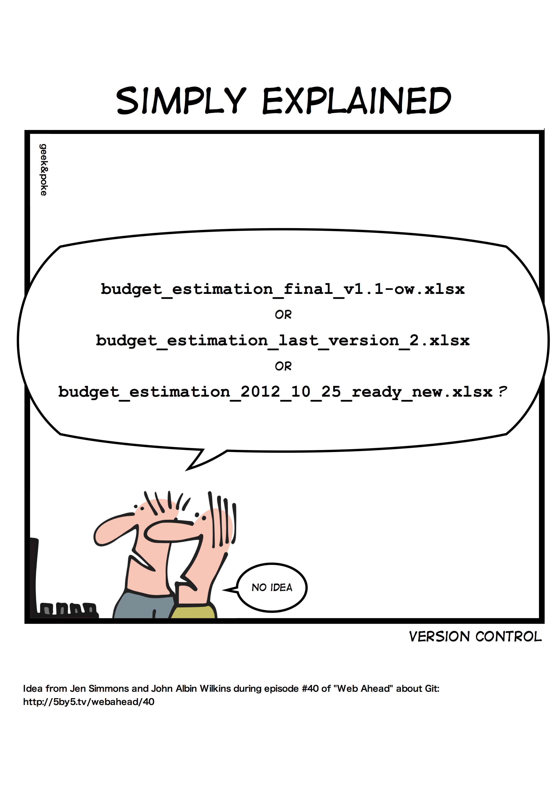</center>

********************************************************************************

{{1-2}}
********************************************************************************

- Store versions in separate files

  - Semantic versioning (Major.Minor.Patch), e.g.,

    - __0.1.0__ (a beta)

    - __1.0.0__ (a release version)

    - __1.0.1__ (a release with slight corrections)

  - can be included in file names

  - define what you consider to be a "release" or a "slight correction"

- Document your versioning scheme and constantly document your changes

  - Readme.md

  - Version control table

  - Data dictionary

- Working in a team? A lot of changes? Use a distributed version control system!

  - Git

  - GitLab, GitHub

---

********************************************************************************

<div style="page-break-after: always;"></div>

{{2-3}}
********************************************************************************

**What a version control table could look like**

| Versionsnr.  | Changes                      | Date      | changed by |
| :----------  | :----------                      | ---        | ---               |
| 1.0          | Release                         | 2016-11-2  | KL                |
| 1.1          | Erased spelling mistakes  | 2016-11-20 | KL                |
| 1.2          | Changed layout            | 2017-02-20 | GN                |
| 2.0          | Add new chapter (3.1.) | 2017-02-20 | GN                |

********************************************************************************

<div style="page-break-after: always;"></div>

{{3-4}}
********************************************************************************
**Example for Version Information within a document:**


Have a look here: [Principles and best practices in data versioning for all data sets big and small](https://www.rd-alliance.org/group/data-versioning-wg/outcomes/principles-and-best-practices-data-versioning-all-data-sets-big)

********************************************************************************

<div style="page-break-after: always;"></div>

{{4}}
********************************************************************************

**Example for a documented versioning scheme:**


Have a look here: [Zenodo](https://zenodo.org/record/6076538#.Y4pE63bMJPa)

********************************************************************************

<div style="page-break-after: always;"></div>

### Develop a naming convention

>__Individual work or group work for people working on the same project__
><!--
style="width: 20%; max-width: 800px; float:right"
title="working"
onclick="alert('Individual work');"
-->
>
>What would be a good folder structure and a good file naming convention for the files related to your PhD project?
>
>__Please document__
>
>1. to which files your folder structure and your naming convention applies
>
>2. a scratch of a folder structure
>
>3. the descriptive aspects to be used in file names and their order
>
>4. the abbreviations used
>
>5. the versioning scheme, if applicable
>
>Use your workspace on the miro-Board to take notes.

<div style="page-break-after: always;"></div>

## Data documentation

{{0-2}}
*********

>**Group work**:
>
><!--
style="width: 20%; max-width: 800px; float:right"
title="group-work"
onclick="alert('Let´s work together!');"
-->
>
>You are working in a research group working on the ecology of forests and take over data from a previous project: <A HREF="sources/average_d.xlsx" download>average_d.xlsx</A>
>
>* Speculate what kind of data it could be.
>
>Discuss and take notes
>
>* Apart from the data itself, what information do you need to be able to work with a dataset?
>
>* What do you notice in regard of data quality?

*********

<div style="page-break-after: always;"></div>

{{1-2}}
*********

<div style="float:left; width:60%;">
  <p>

  **A good data documentation should include**

  - Information on the collection of data

      - Methods, units, time periods, locations, technique used, etc.

  - Structure of the data and their mutual relationships

  - Explanation of variables, labels and codes

  - Differences between different data set versions

  - Measures for data cleaning

  - Information on access and terms of use

      - Licensing

  - Ideal world

      - Description of the research undertaking

        - Goals

      - Hypotheses

</p>


</div>

<div style="float:right; width:40%;">
  
</div>

**************

<div style="page-break-after: always;"></div>

{{2-4}}
********************************************************************************

>**Short research assignment**:
>
>Which guideline of the **DFG Guidelines for Good Scientific Practice** deals with ***documentation***?

********************************************************************************

{{3-4}}
********************************************************************************

><p style="color:#9a047f">**Guideline 12: Documentation**
„Scientists and scholars shall document all information relevant to the achievement of a research result as comprehensibly as it is necessary and appropriate in the concerned scientific field in order to be able to verify and evaluate the result. […]“
</p>
>
><P><SMALL>Deutsche Forschungsgemeinschaft. (2019). Leitlinien zur guten wissenschaftlichen Praxis. Kodex. http://doi.org/10.5281/zenodo.3923602, S. 17.  
</SMALL></P>

********************************************************************************

<div style="page-break-after: always;"></div>

### Metadata

{{0}}
*********

<big>What is Metadata?</big>

*********

{{1}}
*********
 <!--
style="width: 20%; max-width: 800px; float:right"
-->

Metdata is...

- Data about data

- Administrative data

  - Information on the management of the data

  - Mostly generic

- Subject data

  - Individual aspects or data sets in more detail

  - Structured with respect to the research discipline

- Generic standards

  - [DataCite Metadata Schema](https://schema.datacite.org/)

  - [Dublin Core Metadata Initiative](https://dublincore.org/)

- Discipline-specific standards

  - [Metadata Standards Directory](https://rdamsc.bath.ac.uk/)

*******

<div style="page-break-after: always;"></div>

### Understanding Data


<div style="float:left; width:30%;">
  <p>

{{0-9}}
******************
> __Date:__ 364.07
***********

{{2-3}}
***********

<div style="width:40%;">
  
    <sub style="text-align: right;">The DOI® System ISO 26324</sub>
</div>

***********

{{3-4}}
******************

<div style="width:50%;">
  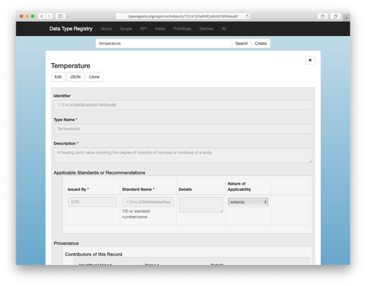
    <sub style="text-align: right;">Temperature in Kelvin 364,07 K ≈ 42,6º C</sub>
</div>

******************

{{4-5}}
*******************


*******************

{{5-6}}
*******************

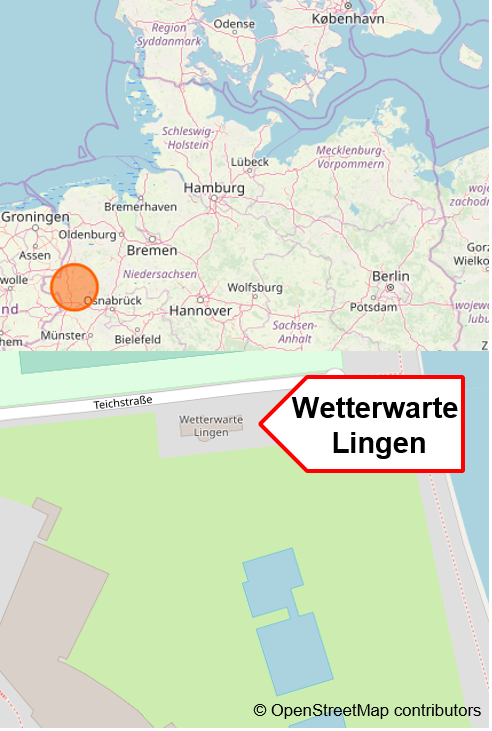

*******************

{{6-7}}
*************

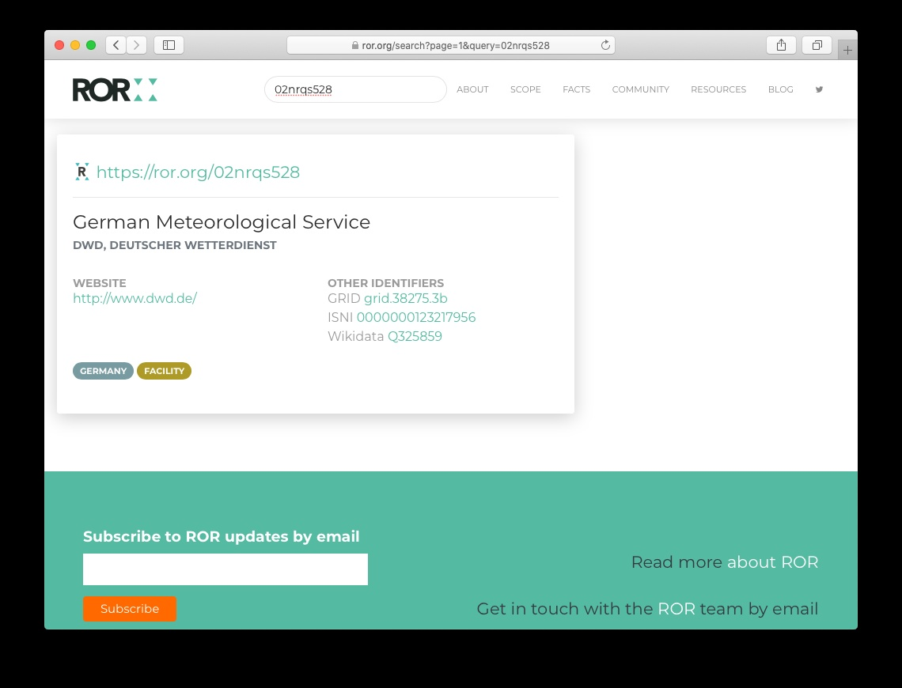

---


*******************

</p>

</div>

<div style="float:right; width:60%;">

{{1-2}}
***********
Data about Data

- Identifier: 10.1594/dwd-weather-data
- Identifier Type: DOI
- Unit: K
- Data Type Identifier: 11314.3/0a9062a9cb51995dea9f
- Date: 2019-07-25T15:00:00Z
- Location: 52.5178687 7.3057642
- Creator: Deutscher Wetterdienst
- ROR: 02nrqs528

***************

{{2-3}}
*************
Origin, Location and Meaning of Data

> - Identifier: 10.1594/dwd-weather-data
>
> - Identifier Type: DOI
- Unit: K
- Data Type Identifier: 11314.3/0a9062a9cb51995dea9f
- Date: 2019-07-25T15:00:00Z
- Location: 52.5178687 7.3057642
- Creator: Deutscher Wetterdienst
- ROR: 02nrqs528

************

{{3-4}}
******************
Origin, Location and Meaning of Data

- Identifier: 10.1594/dwd-weather-data
- Identifier Type: DOI
> - Unit: K
>
> - Data Type Identifier: 11314.3/0a9062a9cb51995dea9f
- Date: 2019-07-25T15:00:00Z
- Location: 52.5178687 7.3057642
- Creator: Deutscher Wetterdienst
- ROR: 02nrqs528

***************

{{4-5}}
*******************
Origin, Location and Meaning of Data

- Identifier: 10.1594/dwd-weather-data
- Identifier Type: DOI
- Unit: K
- Data Type Identifier: 11314.3/0a9062a9cb51995dea9f
>- Date: 2019-07-25T15:00:00Z
- Location: 52.5178687 7.3057642
- Creator: Deutscher Wetterdienst
- ROR: 02nrqs528

****************

{{5-6}}
**************
Origin, Location and Meaning of Data

- Identifier: 10.1594/dwd-weather-data
- Identifier Type: DOI
- Unit: K
- Data Type Identifier: 11314.3/0a9062a9cb51995dea9f
- Date: 2019-07-25T15:00:00Z
> - Location: 52.5178687 7.3057642
- Creator: Deutscher Wetterdienst
- ROR: 02nrqs528

**************

{{6-7}}
*************
Origin, Location and Meaning of Data

- Identifier: 10.1594/dwd-weather-data
- Identifier Type: DOI
- Unit: K
- Data Type Identifier: 11314.3/0a9062a9cb51995dea9f
- Date: 2019-07-25T15:00:00Z
- Location: 52.5178687 7.3057642
> - Creator: Deutscher Wetterdienst
>
> - ROR: 02nrqs528

***************************
{{7-8}}
*************
Origin, Location and Meaning of Data

- Identifier: 10.1594/dwd-weather-data
- Identifier Type: DOI
- Unit: K
- Data Type Identifier: 11314.3/0a9062a9cb51995dea9f
- Date: 2019-07-25T15:00:00Z
- Location: 52.5178687 7.3057642
- Creator: Deutscher Wetterdienst
- ROR: 02nrqs528
> - **Description**: Air temperature measurement at the weather station Lingen, Germany, on 29 July 2019 in Kelvin
**************

<div style="page-break-after: always;"></div>

{{8-9}}
*************
**Traceability**

<div style="width:100%;">
  
    <sub style="text-align: right;"></sub>
</div>


*****************

</div>

---

### Mandatory Metadata

>**Individual work**:
> <!--
style="width: 20%; max-width: 800px; float:right"
title="working"
onclick="alert('Data documentation');"
-->
>
>Do you know the [Kiel University research data repository](https://opendata.uni-kiel.de/content/index.xml)?
>
>Go to
>https://opendata.uni-kiel.de/content/publish/metadata.xml?lang=en
>
>* Which metadata is mandatory?
>
>* Is this information sufficient to understand your research data?


<div style="page-break-after: always;"></div>

## BREAK

<center>

**Have a break!**


</center>

<div style="page-break-after: always;"></div>

## File formats

>**Group work**:
><!--
style="width: 20%; max-width: 800px; float:right"
title="puzzle"
onclick="alert('Let´s work together!');"
-->
>
> Let us collect all file formats you are working with.
>
>Post all file formats you are working with into the answergarden:
>
>https://answergarden.ch/3931685

{{1}}
*************

<iframe src="https://answergarden.ch/3931685" style="border:0px;width:100%;height:500px" allowfullscreen="true" webkitallowfullscreen="true" mozallowfullscreen="true"></iframe>

*************
<div style="page-break-after: always;"></div>

### Choosing file formats

>-> Non-Proprietary, unencrypted, uncompressed and commonly used
>
>-> Open-standard-compliant, documented and royalty-free

| Data Type    | Recommended | Trade-off Matter | Not Recommented |
| ------------ | ----------- | ---------------- | --------------- |
| Tabular      | CSV, TSV, ODS| XLSX, SPSS portable| XLS, SPSS |
| Textual      |TXT, MD, HTML, ODT | DOCX, RTF, PDF/A | DOC, PDF, PS |
| Presentation | ODP, HTML   |  PPTX            |   PPT           |
| video        |MP4, MKV, OGG|  WEBM            | WMV, MOV, QT, Flash|
| Audio        | MP4, FLAC, WAV, OGG | MP3, AIF |                 |
| Image        | TIFF, PNG   |  BMP, JPG        |   PSD, GIF      |
| Vector       |  SVG        |                  |     AI          |
| Generic      |  XML, JSON, RDF |              |                 |
| Container    | Bagit, Frictionless, Data Package| ZIP, TAR |      |

<div style="page-break-after: always;"></div>

## Back up & long-term storage

{{0}}
Where do you store your data?
---

<div style="float:right; width:40%;">
  
</div>


{{1}}
****************
> **Recommendations for your back up**
>
>- At least 3 copies of a file
>- On at least 2 different media
>- At least one of which is remote
>- Test data recovery at the beginning and at regular intervals.

****************

{{2}}
How do your store your (sensitive) data?
---

{{3}}
****************
> **Protect your (sensitive) data**:
>
>- Hardware (e.g. separate lockable room).
>- File encryption
>- Password security
>- At least two people should have access to your data

*****************

<div style="page-break-after: always;"></div>

### Back up vs. long-term storage

| Back up                                                                          | Long-term storage             |
| -------------------------------------------------------------------------------- | ----------------------------- |
| Automatic backup of all data   | Storage of only selected data |
| All versions                                                                     | Final version only            |
|   to prevent data loss (technical, e.g. defective, or human, e.g. accidentally deleted) | Integrity backup       |
|                                                                                  | Long-term storage             |
|                                                                                  | Searchability                 |

<div style="page-break-after: always;"></div>

## FAIR Data Principles

{{0-1}}
****************

>***An important goal of structured research data management is to keep data accessible, reusable and verifiable in the long term and independent of individuals.***

<div style="width:50%;">
  
  <sub><span style="text-align: right;">Illustration: Patrick Hochstenbach in Engelhardt, Claudia et. al. (2021)</span></sub>
</div>

****************

<div style="page-break-after: always;"></div>

{{1}}
>**F**indable

{{2-3}}
****************
The first step in (re)using data is to find them. Metadata and data should be easy to find for both humans and computers. Machine-readable metadata are essential for automatic discovery of datasets and services, so this is an essential component of the FAIRification process.

F1. (Meta)data are assigned a globally unique and persistent identifier

F2. Data are described with rich metadata (defined by R1 below)

F3. Metadata clearly and explicitly include the identifier of the data they describe

F4. (Meta)data are registered or indexed in a searchable resource

***************

{{1}}
>**A**ccessible

{{3-4}}
***********************
Once the user finds the required data, she/he/they need to know how they can be accessed, possibly including authentication and authorisation.

A1. (Meta)data are retrievable by their identifier using a standardised communications protocol

A1.1 The protocol is open, free, and universally implementable

A1.2 The protocol allows for an authentication and authorisation procedure, where necessary

A2. Metadata are accessible, even when the data are no longer available

******************

{{1}}
>**I**nteroperable

{{4-5}}
**********************
The data usually need to be integrated with other data. In addition, the data need to interoperate with applications or workflows for analysis, storage, and processing.

I1. (Meta)data use a formal, accessible, shared, and broadly applicable language for knowledge representation.

I2. (Meta)data use vocabularies that follow FAIR principles

I3. (Meta)data include qualified references to other (meta)data

**********************

{{1}}
>**R**eusable

{{5-6}}
***************
The ultimate goal of FAIR is to optimise the reuse of data. To achieve this, metadata and data should be well-described so that they can be replicated and/or combined in different settings.

R1. Meta(data) are richly described with a plurality of accurate and relevant attributes

R1.1. (Meta)data are released with a clear and accessible data usage license

R1.2. (Meta)data are associated with detailed provenance

R1.3. (Meta)data meet domain-relevant community standards

**************

<div style="page-break-after: always;"></div>

### Snafu Video

Movie time!

---

<iframe width="560" height="315" src="https://www.youtube.com/embed/66oNv_DJuPc" title="YouTube video player" frameborder="0" allow="accelerometer; autoplay; clipboard-write; encrypted-media; gyroscope; picture-in-picture; web-share" allowfullscreen></iframe>

---

{{1}}
****************

> **Group work**:
><!--
style="width: 20%; max-width: 800px; float:right"
title="working"
onclick="alert('Group work');"-->
>Your will be assigned to group F, A, I or R.
>
>Please discuss in each group:
>
>* What is the benefit of good research data management?
>
>* Depending on the group your are assigned to, please also discuss what aspects, problems & solutions have been touched  
>
>   * regarding F(indability),
>   * A(ccessibility)
>   * I(nteroperability)
>   * R(eusablity) of data.
>
>Use the [Miro-Board](https://miro.com/app/board/uXjVPvwAFbI=/?moveToWidget=3458764555145308718&cot=14) to take notes.

****************

{{2}}
********************
The benefits of good research data management are...
---
- Reproducibility of results
- Findability of the data
- Traceability of research
- Transparency of research
- Quality assurance and quality attribute
- Efficiency in the research process
- Sustainability
- Knowledge generation
- No redundancy
- Structuring, organisation
- Enable collaborations
- …
- …
****************

<div style="page-break-after: always;"></div>


### How FAIR is your data?

>__Let´s discuss!__
><!--
style="width: 20%; max-width: 800px; float:right"
title="working"
onclick="alert('Individual work');"
-->
>Think about your own project and evaluate the handling of your research data against the FAIR principles.
>
>- Which of the FAIR principles do you already comply with?
>- Where do you (or all of us) need to improve?
>- What do you need in order to comply with the FAIR principles?

<div style="page-break-after: always;"></div>

## Open X

* Open Science

* Open Access

* Open Data

* Open Educational Resources

* Open Source Research Software

* Open Methodology

* Citizen Science

* ...


<div style="page-break-after: always;"></div>

### Open Access

>"Open access is the term given to access granted to research publications and other materials online free of charge. A research document published under open access conditions may be read, downloaded, saved, linked to, printed and used by anybody at no cost."
>
>Source: [DFG](https://www.dfg.de/en/research_funding/programmes/infrastructure/lis/open_access/what_is_open_access/index.html)

<div style="float:left; width:80%;">
**Open access** contributions are often represented with the help of an open lock.

- Distribution of research output online, __freely available__ for everyone

  - __no restrictions__ for use und republication

  - In practice: __attribution__ to the original author or creator

- Formerly only open publication of journal articles, papers, etc.

</div>

<div style="float:right; width:10%;">

</div>

### Open Access at Kiel University

>**Information and services @Kiel University:**
>
>* [Guidelines for promoting Open Access at Kiel University](https://www.praesidium.uni-kiel.de/de/dokumente/leitlinien-der-cau-zu-open-access)
>* [University Library](https://www.ub.uni-kiel.de/de/publizieren/publizieren/informationen) provides information, help and services.
>* [MACAU is the Open Access Repository of Kiel University (CAU)](https://macau.uni-kiel.de/content/publish/information.xml)

<div style="page-break-after: always;"></div>

### Open Data

>"Open data are data that have been made available for free use, re-use and dissemination. They can comprise any kind of data from learning materials to geographical data, statistics, traffic data, academic publications, medical data, radio and tv broadcasts.
>
>In oder to mark data as "open", different choices of license are available. Data with restrictive licences, which limit use by prohibiting derivatives or commercial use, do not strictly count as "open data" even though they can certainly improve the academic exchange of ideas." (https://forschungsdaten.info/praxis-kompakt/english-pages/open-data-open-access-and-re-using-data/)

-----

- Open Data

  - Publication of data without legal or technical restrictions
  - for use, re-use and dissemination
  - __Indispensable__ for data science
  - Generic __non-proprietary__ formats
  - different types of data as well as __Metadata__

-----

{{1}}
********************

>**What do you think?**
>
>$$
OPEN
=
FAIR\, ?
$$

********************

<div style="page-break-after: always;"></div>

### Open Data at Kiel University

>**Information and services @Kiel University:**
>
>* No guidelines for promoting Open Data at Kiel University :-(
>* [Central Research Data Management](https://www.datamanagement.uni-kiel.de/de) provides information, help and services.
>* [**opendata@uni-kiel**](https://opendata.uni-kiel.de/content/index.xml) is the Open Data Repository of Kiel University (CAU)

### Licenses
{{0-1}}
*******************
- Licenses regulate conditions of subsequent use of published data.
- Free licenses allow the use, redistribution and modification of copyrighted works

  - are usually available for free use and only need to be linked to
  - Prerequisite is that you are the copyright holder


Selection of the license depends on the type of data:

  - e.g. Creative Commons (CC) licenses for articles, monographs, images, etc.

  - Open-Database-License (ODbL) for DB or CC starting with version 4

  - General Public License (GNU) for software

- If no license is granted, the stricter copyright applies, as far as applicable to data

***********

<div style="page-break-after: always;"></div>

{{1-2}}
******************
> **CC-Licenses**

><div style="width:100%;">
  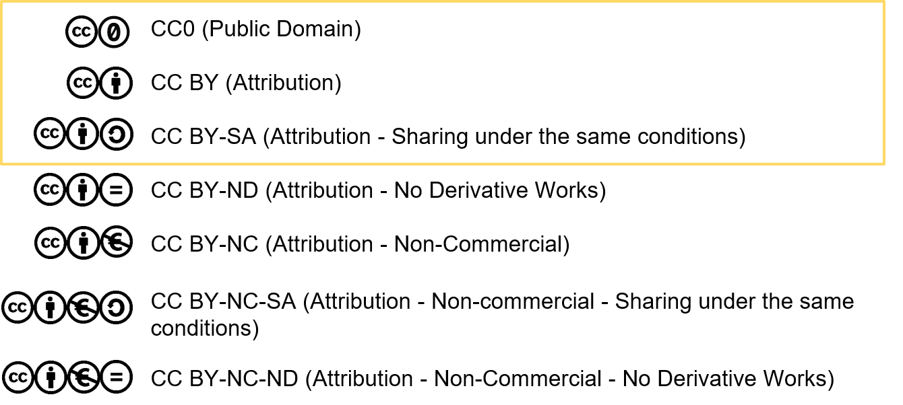
</div>


*********************

<div style="page-break-after: always;"></div>

{{2-3}}
******************
> **ODC-Licenses**

<div style="width:100%;">
  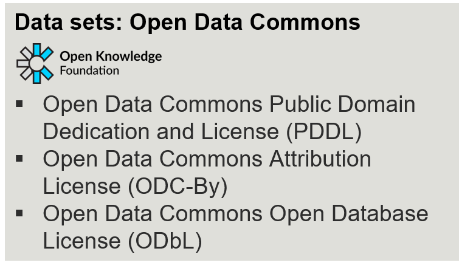
</div>

*********************

<div style="page-break-after: always;"></div>

{{3-4}}
************
**Take care!**

>$$
no\,license
\not =
free\,license
$$

********************

<div style="page-break-after: always;"></div>


## Data publication

 How to publish and share your data?
----

{{1}}
********************
> Supplement to a peer-reviewed article ("enhanced publication")
********************

{{2-3}}
****************
- as a supplement to the associated article
- as a data set in a repository with a link to the corresponding article.

Example:

<div style="width:100%;">
  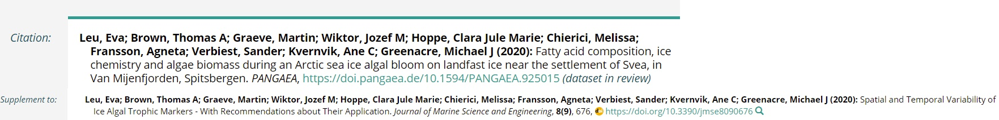
</div>

**********************

<div style="page-break-after: always;"></div>

{{1}}
********************
> Independent information object in a research data repository
********************

{{3-4}}
********************

* Discipline-specific repositories, e.g. [Datorium](https://data.gesis.org/sharing/#!Home), [Pangaea](https://www.pangaea.de/)

* cross-disciplinary repositories, e.g. [ZENODO](https://zenodo.org/)

* institutional repositories, e.g. [Refubium](https://www.fu-berlin.de/sites/open_access/refubium/index.html), [opendata@uni-kiel.de](https://opendata.uni-kiel.de/content/index.xml)

Example:

<div style="float:left; width:45%;">
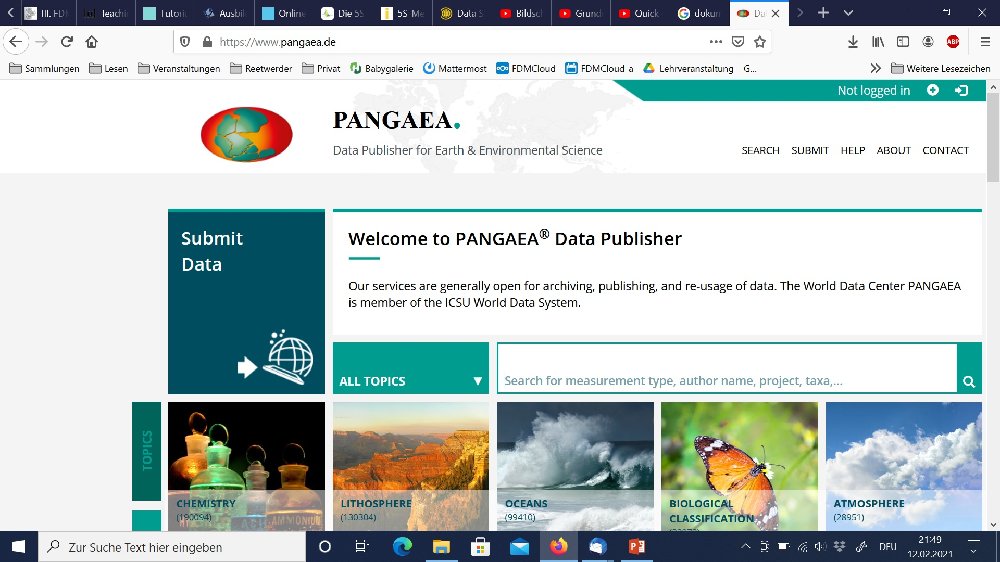
<sub>Source: https://www.pangaea.de/, Zugriff 10.02.2021</sub>

</div>

<div style="float:right; width:45%;">

<div style="width:100%;">
  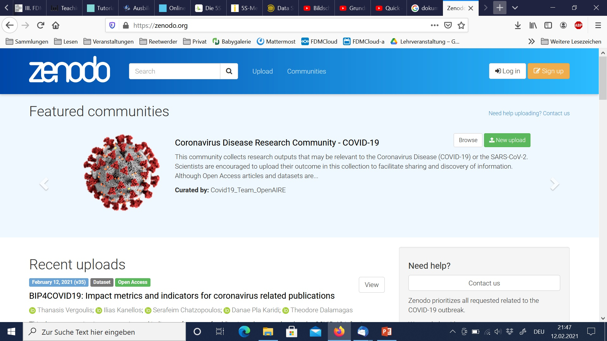
  <sub>Source: https://zenodo.org/, Zugriff 10.02.2021</sub>
</div>

</div>

*********************

<div style="page-break-after: always;"></div>

{{1}}
********************
> Data journals

********************

{{4-5}}
***************************

- publish detailed description of data

- partly peer-reviewed

Example:

<div style="float:left; width:45%;">
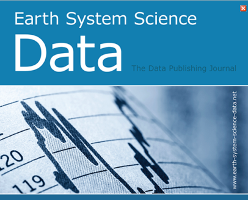
<sub>Source: https://www.earth-system-science-data.net, Zugriff 10.02.2021</sub>

</div>

<div style="float:right; width:45%;">

<div style="width:100%;">
  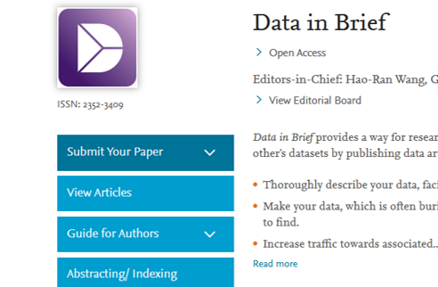
  <sub>Source: https://www.journals.elsevier.com/data-in-brief, Zugriff 10.02.2021</sub>
</div>

</div>

***************************

<div style="page-break-after: always;"></div>

### Repositories
{{0-2}}
**What is a repository?**

{{1-2}}
****************
>*"A repository (Latin repositorium, 'storehouse') is a managed place for storing ordered documents that are accessible to the public or to a restricted group of users. An archive (Latin archivum, file cabinet'), on the other hand, manages only historical documents.“*
>
>*"Digital research data repositories are information infrastructures that store and organize digital research data...as permanently as possible...to ensure the discoverability and accessibility of the data...“*
>
>^Source: Esther Asef, Katarzyna Biernacka, Elisabeth Böker,Sarah Ann Danker, Juliane Jacob, Janna Neumann, Britta Petersen, Jessica Rex und Ute Trautwein-Bruns (2021): Data Sharing interaktiv vermitteln^

************************

<div style="page-break-after: always;"></div>

{{2-5}}
**How to find a repository**

{{3-4}}
***************

<div style="float:left; width:45%;">

**re3data.org**

- Collection of repositories
- Worldwide
- Various disciplines
- Researchers, funders, publishers and institutions

</div>

<div style="float:right; width:45%;">
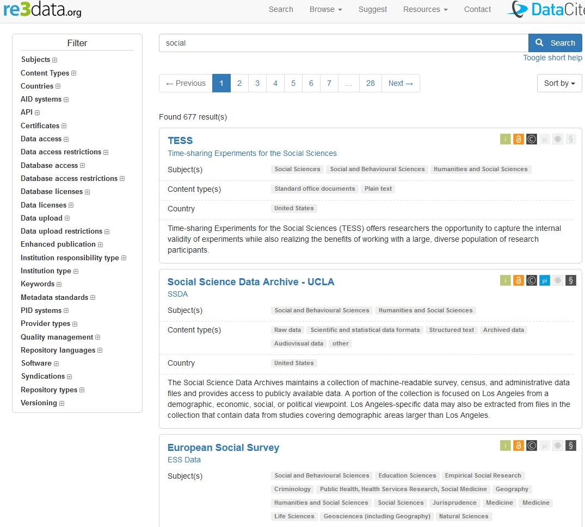
<sub>Source: re3data About. http://service.re3data.org/about. Zugriff 10.02.2021</sub>
</div>

***************


<div style="page-break-after: always;"></div>

{{4-5}}
*************

<div style="float:left; width:45%;">

**risources.dfg.de**

- Offer of the DFG
- Information portal
- Germany-wide
- Research Infrastructures
- For researchers

</div>

<div style="float:right; width:45%;">
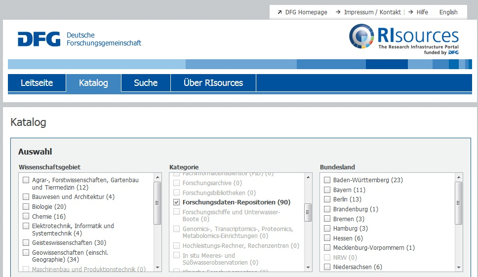
<sub>Source: http://risources.dfg.de/index.html#q=*&sort=RI_SORT_DE%20asc&rows=10&RI_EXT=Y. Zugriff 10.02.2021</sub>
</div>

************

<div style="page-break-after: always;"></div>

{{5}}
**************

<div style="float:right; width:10%;">

</div>

<div style="float:left; width:80%;">
>__Individual work__
> Search **re3data.org** for a repository that is appropriate for your data.
>
>Let us discuss your search and selection.

</div>

*****************

<div style="page-break-after: always;"></div>


## BREAK

<center>

**Have a break!**


</center>

<div style="page-break-after: always;"></div>

## Data management plan (DMP)

> What is a data management plan?

{{1-2}}
**********
- All information that adequately describes and documents the collection, processing, storage, archiving, and publication of research data in the context of a research project.

- "[...] analysis of the workflow from the generation of the data to their use.“^1^

^[1] J. Ludwig, H. Enke (Hrsg.) Leitfaden zum Forschungsdaten-Management. Handreichungen aus dem WissGrid-Projekt. Verlag Werner Hülsbusch: Glückstadt, 2013.^

***********

<div style="page-break-after: always;"></div>

> Components of a DMP

{{2-3}}
**********
- Administrative information

  - Project name, data originator, other contributors, contact, funding program, etc.

- Project abstract

  - Data set descriptions
  - Data types, formats, scope
  - Metadata and standards information
  - Data sharing
  - Archiving and backup of data
  - Responsibilities
  - Legal and ethical aspects (e.g., licences, GDPR, Nagoya protocol, CARE)
  - Costs


Length can vary from a few paragraphs to several pages!

*********

<div style="page-break-after: always;"></div>

### Sketching out a DMP

>__Individual work__
><!--
style="width: 20%; max-width: 800px; float:right"
title="working"
onclick="alert('Individual work');"
-->
>
>Download the CAU template for data management plans: [CAU\_DMP\_Template](https://www.datamanagement.uni-kiel.de/de/service/materialien)
>
>Have look at the template and try to sketch out a DMP for your research project.
>
> * What information do you already have?
> * What information is missing to fill the template?

<div style="page-break-after: always;"></div>

## RDM related organisations & funder requirements

{{0-1}}
************

>**Research Data Alliance**

>**Nationale Forschungsdateninfrastruktur (NFDI)**

>**Deutsche Forschungsgemeinschaft (DFG)**

> **Horizon 2020 & Horizon Europe**

************

<div style="page-break-after: always;"></div>

{{1-2}}
************

>**Research Data Alliance**

************

{{1-2}}
************

<div style="float:left; width:60%;">

- International organisation founded in 2012

  - __Vision__: Researchers and innovators openly share data across technologies, disciplines, and countries to address the grand challenges of society

  - __Mission__: RDA builds the social and technical bridges that enable open sharing of data

- __Bottom-up__ development of practices, infrastructures, tools, technologies, services, approaches, policies, etc.
- __Practitioners__ come together in [Birds of a Feather-Groups (BoF)](https://www.rd-alliance.org/groups/creating-and-managing-rda-groups/creating-or-joining-birds-feather-group), [Interest Groups (IG)](https://www.rd-alliance.org/groups/interest-groups) or [Working Groups (WG)](https://www.rd-alliance.org/groups/working-groups)
- Regional chapters, e.g., [RDA Europe](https://www.rd-alliance.org/rda-europe) or [RDA Deutschland e.V.](https://www.rda-deutschland.de/)
- Strong __influence__ on European Commission, BMBF, DFG, …

</div>

<div style="float:right; width:30%">
  
</div>

*****************

<div style="page-break-after: always;"></div>


{{2-3}}
************

>**Nationale Forschungsdateninfrastruktur (NFDI)**

************

{{2-3}}
*****************

<div style="float:left; width:60%;">

- National research data management initiative in Germany
- Initiated by the [German Council for Scientific Information Infrastructures](http://www.rfii.de/en/home/)

- Horizontal linking of existing actors

  - Discipline-specific [NFDI consortia](https://www.nfdi.de/konsortien-2) with with binding roadmaps

  - Bring into use existing infrastructure

  - Identify and fill gaps
- Interoperability of data and infrastructure

- Use of NFDI will probably get mandatory
- Participation in the work of NFDI consortia possible

</div>

<div style="float:right; width:30%">
  
</div>

********************

<div style="page-break-after: always;"></div>

{{3-4}}
************

>**Deutsche Forschungsgemeinschaft (DFG)**

************

{{3-4}}
****************
<div style="float:left; width:60%;">

- Code of Conduct:
  [Guidelines for Safeguarding Good Research Practice](https://www.dfg.de/en/research_funding/principles_dfg_funding/good_scientific_practice/index.html)
- Guideline 7 – Quality assurance

  - Disclosing of origin of data, organisms, materials and software used
  - Reuse of data is clearly indicated; original sources are cited
  - Description of nature and scope of research data generated
  - Handling of research data in accordance with requirements of relevant subject area

- Guideline 13 – Public access

  - Making available research data where possible and reasonable

  - Making available software programmed by researchers with source code
- FAIR Principles

</div>

<div style="float:right; width:30%">
  
</div>

*****************

<div style="page-break-after: always;"></div>

{{4-5}}
************

> **Horizon 2020 & Horizon Europe**

************

{{4-5}}
*****************

<div style="float:left; width:60%;">

- Framework Programme for Research and Technological Development of the European Commission:

- [Horizon 2020 Online Manual – Data Management](https://ec.europa.eu/research/participants/docs/h2020-funding-guide/cross-cutting-issues/open-access-data-management/data-management_en.htm)

- [Horizon Europe – Programme Guide – Open Science](https://ec.europa.eu/info/funding-tenders/opportunities/docs/2021-2027/horizon/guidance/programme-guide_horizon_en.pdf#page=38)

- [Horizon Europe – Data Management Plan Template](https://ec.europa.eu/info/funding-tenders/opportunities/docs/2021-2027/horizon/temp-form/report/data-management-plan-template_he_en.docx)

- Open access to research data is applicable by default

  - as open as possible, as closed as necessary

- Make research data findable, accessible, interoperable and re-usable (FAIR)

- DMP should include information on:

  - The handling of research data during & after the end of the project

  - What data will be collected, processed and/or generated

  - Which methodology & standards will be applied

  - Whether data will be shared/made open access and

  - How data will be curated & preserved (including after the end of the project)

</div>

  <div style="float:right; width:30%">
    
  </div>

******************

<div style="page-break-after: always;"></div>

## RDM @ CAU
{{0-1}}
************
>__Individual work__
><!--
style="width: 20%; max-width: 800px; float:right"
title="working"
onclick="alert('Individual work');"
-->
>
>You have 5 minutes to perform an internet search!
>
>Are there any guidelines for handling research data at CAU?
>
>Are there specific guidelines for handling research data at your institute?
>
>Who are the contact persons at CAU and/or your institute if you have questions about handling your digital research data?

*************

<div style="page-break-after: always;"></div>

{{1-2}}
***********
CAU Guideline on Research Data Management

[Kiel University’s Recommendations on Handling Research Data](https://www.praesidium.uni-kiel.de/de/dokumente/leitlinie-zum-umgang-mit-forschungsdaten-guideline-on-research-data-management-english)
---
- __Research data__ are the __basis and result__ of scientific work and are therefore of particular significance. It is important to handle research data responsibly to ensure that __scientific work is traceable, verifiable and reusable__
- Handling research data is __subject to constant__ change due to __advances in research__
- Kiel University continuously assists with this ongoing process by implementing appropriate measures

************

{{2-3}}
************
Principle 1
---
- __Research data__ are __all data created in the process of research work__ through observation, collection, experiments, simulation, and further processing for the __purpose of producing and validating research results__
- __Research data management__ covers __all areas of data administration__: data acquisition, data preservation, data security and data integrity, as well as the release and publication of data

**************

{{3-4}}
************
Principle 2
---
- Research data management is performed in accordance with current professional standards while respecting the DFG (German Research Foundation) proposals for safeguarding good scientific practice
- Research data management is documented in a data management plan
- __Responsibility__ for research data management lies with the head of the particular research activity.

*************
{{4-5}}
***********
Principle 3
---
- Research data is made accessible to the public in national or international subject-specific archives under appropriate licensing; if no such archives exist, central university services are used
- __Scientific and legal interests__ of the researchers, the protection of the personal details of participants, patients and other individuals affected by the collected data, as well as other __obligations to third parties__ – for example, cooperation partners – as well as ethical, legal and economic restrictions __must be observed__
- __Kiel University assists researchers__ through its __central infrastructure facilities__

  - Acquisition and preservation of research data

  - Formulating and maintaining standards for handling research data

  - Appropriate training and advisory service offers created in cooperation with the specialist disciplines

- Kiel University recommends and assists with anchoring the significance of subject-specific, structured research data management in teaching by the particular subject areas

************

<div style="page-break-after: always;"></div>

## Take-Away Messages

> Practical Take-Away Messages
---

1. <p style="color:#9a047f">**Document your data**</p>

{{1-2}}
************
>- Use documented naming and versioning conventions
>
>- document changes
>
>- think about metadata necessary to understand your data

*************

2. <p style="color:#9a047f">**Formats**</p>

{{2-3}}
************
>  - __Generic and open standard file formats__ last longer than proprietary file formats
>
>    - Open Document Format (ODF)
>
>    - Comma separated values (CSV)
>
>    - Raw text files (TXT, MD)
>
>  - __Data container formats__ for __exchange, archival and publication__, e.g., [BagIt](https://tools.ietf.org/html/rfc8493), [Frictionless Data](https://frictionlessdata.io/)

*************

3. <p style="color:#9a047f">**Storage**</p>

{{3-4}}
**********
>  - __Central infrastructure with backup__ for storage
>
>  - Desktop and laptop for work on current research data only
>
>  - Systematic file and folder naming and hierarchy
>
>  - Provide _Readme_ files
>
>  - Data Management Middleware for handling data and metadata, e.g., [iRODS](https://irods.org/)
>
>  - DFG [Guidelines for Safeguarding Good Research Practice](https://www.dfg.de/en/research_funding/principles_dfg_funding/good_scientific_practice/index.html)  require 10 years of preservation at least!

************

4. <p style="color:#9a047f">**Publication**</p>

{{4-5}}
************
>  - Discipline-specific Repositories with specific metadata support
>
>    - [re3data: Registry of Research Repositories](https://www.re3data.org/)
>
>  - National or international initiatives
>
>    - NFDI (work in progress)
>
>    - [European Open Science Cloud Services](https://marketplace.eosc-portal.eu/services/c/sharing-discovery)
>
>  - Institutional Data Repository: [opendata@uni-kiel](https://opendata.uni-kiel.de/)
>
>  - Generic Repositories
>
>    - [Zenodo](https://zenodo.org/)

************

5. <p style="color:#9a047f">**Licensing**</p>

{{5-6}}
**************
>  - [Creative Commons](https://creativecommons.org/): data with a necessary creation height; ideally CC0 or CC BY
>
>- [Open Data Commons](https://opendatacommons.org/): databases, raw data

**********

<div style="page-break-after: always;"></div>

## Questions

>**Nearly done!**
> <!--
style="width: 10%; max-width: 800px; float:right"
title="puzzle"
onclick="alert('Questions?');"
-->
>
>Time for open questions!

<div style="page-break-after: always;"></div>

## One Minute Paper

>  __Individual work__
> <!--
style="width: 20%; max-width: 800px; float:right"
title="working"
onclick="alert('Individual work');"
-->
>
>Please take a piece of paper or create an own pad (e.g. https://zumpad.zum.de/).
>
>You have one minute.
>
>Please write down the most important points of our workshop today.

<div style="page-break-after: always;"></div>

## Feedback

>**Please give us some feedback!**
>
> You have a date with some friends tonight.
>
>Your friends remember that you attended a workshop on research data management today and asks: “Well, how was it”?
>
>What do you answer?
>
> | :-)  | :-/  | :-(  |

<div style="page-break-after: always;"></div>

## CAU contacts


<div style="float:right; width:40%">
  
</div>

**RDM contacts at CAU**:

https://www.fdm.uni-kiel.de/de/team

<div style="page-break-after: always;"></div>

## Thank you!

:-)
